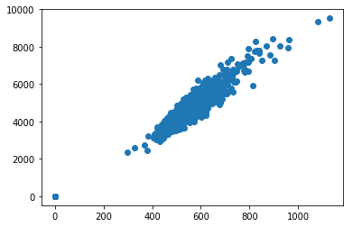
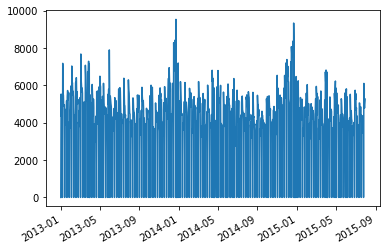
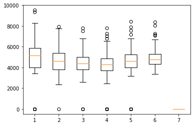

# 机器学习(进阶)
## 毕业项目开题报告
徐思远
2018年03月06日

## Rossmann 销售预测
### 1.研究背景

在众多的机器学习研究中，根据数据集中是否给出样本标签，我们可以将机器学习简单的分为监督学习和非监督学习两大类。一般的，监督学习中的数据集是由输入信息（特征）和预期输出（分类标签或连续数值标签等）组成的，机器学习算法在观察一些样本之后，对输入和输出之间的映射关系建立模型，并对任意的输入信息进行预测[^1]，非监督学习则是对仅包含特征信息的数据集进行聚类分析。

基于监督学习的学习模式和数据组成，监督学习主要可以解决两类问题：回归问题和分类问题。从机器学习广泛应用之初，监督学习在诸如数据分类、回归预测等领域中的成果十分显著[^2]。受数据数量和质量的影响，早期的监督学习应用大多集中在金融、教育领域，而随着大数据在诸多行业中逐步受到重视，监督学习在更多行业中的实用价值也越来越高。

在面临大量**特征-标签**模式的数据时，人类的经验判断法也并不是不能得到任何结果，只是这一经验模式很难被完整的量化并应对新的输入信息，从而无法得到理想的准确度和效率，而机器学习则可以将这一问题简化为类似于$AX+b=Y$（当然不止于此）这样的数学问题并进行海量的训练。因此机器学习在销售、水文地质等具有大数据背景的行业中可以极大的提高数据分析、挖掘效率，快速学习大量数据模式并进行实时响应，以此来实现指导、优化分配的任务。

### 2.问题描述

在毕业项目中，我选择了 Rossmann 销售预测作为毕业题目。Rossmann 来自德国，是一家在欧洲拥有超过3600家分店的连锁药店。其庞大的体量在带来可观利润的同时也对销售管理、配货管理以及市场预测提出了挑战。在已经积累的历史数据中，门店销售额的影响因素众多，例如促销活动安排、商业竞争、学校假期和法定假期等等因素都会影响门店的销售额。Rossmann 需要提前六周对门店的日销售额进行分析和预测，Rossman 的数千名独立经理人根据自身经验实现的预测结果则良莠不齐，很难依据经理人的判断来指导市场调控。

在本项目中，我们需要根据 1115 家门店的历史数据进行研究，并建立一个鲁棒性强的预测模型，并在提前六周的预测任务中得到一个令人可以接受的结果。

### 3.数据集和输入特征

本项目在 Kaggle 上以数据挖掘竞赛的形式提供[^3]。在本项目中，我们可以拿到以`csv`格式呈现的四张数据表单，它们分别是：

- train.csv - 包含具体销售额的历史数据训练集；
- test.csv - 不包含销售额的历史数据测试集；
- sample_submission.csv - 提交数据预测结果的正确格式样本；
- store.csv - 门店的额外补充信息；

我们可以运用 train.csv 和 store.csv 所提供的信息来对模型进行训练，test.csv 是测试集文件，在预测模型训练完成后，我们需要对 test.csv 中的样本进行预测，并将预测结果依照 sample_submission.csv 中的格式进行整理。最终的结果评价交由 Kaggle 进行。

- **Id** - 一例特定日期和特定门店的样本。
- **Store** - 各门店唯一的编号
- **Sales** - 销售额（本项目的预测内容）。
- **Customers** - 日客流量。
- **Open** - 用来表征商店开张或闭店的数据，0表示闭店，1表示开张。
- **StateHoliday** - 用来表征法定假期。除了少数例外，通常所有门店都会在节假日关闭。值得注意的是，所有学校在法定假期以及周末都会关闭。数据a表示公共假期，b表示复活节，c表示圣诞节，0则意味着不是假期。
- **SchoolHoliday** - 用来表征当前样本是否被学校的关闭所影响，也可以理解为学校放假。
- **StoreType** - 使用a,b,c,d四个值来表征四种不同类型的商店
- **Assortment** - 表征所售商品品类的等级，a为基础型，b为大型，c为特大型。
- **CompetitionDistance** - 距离最近竞争商家的距离（m）。
- **CompetitionOpenSince[Month/Year]** - 距离最近竞争商家的开业时间。
- **Promo** - 表征某天是否有促销活动。
- **Promo2** - 表征门店是否在持续推出促销活动
- **Promo2Since[Year/Week]** - 以年和年中周数表征该门店参与持续促销的时间。
- **PromoInterval** - 周期性推出促销活动的月份，例如 "Feb,May,Aug,Nov" 表示该门店在每年的2月5月8月和11月会周期性的推出促销活动。

为了对数据集形成一个初步印象，我简单查看了id为1的一家商店的一些特征和销售额间的关系。

|   客流量--销售额    |     日期--销售额     |   星期几--销售额    |
| :-----------------: | :------------------: | :-----------------: |
|  |  |  |

可以看出，客流量和销售额基本呈现出线性相关，日期和销售额之间则有一定的周期性，而周日则没有销售额，因为周末门店不开张。总的来说，数据集包含了门店基础信息（编号、规模、开张与否），客流信息，社会和学校的假期信息，竞争商家信息以及促销信息。从社会经验上来说，这些信息都和门店的销售额有关。开张的门店才会有销售额产生；规模大的门店则能够解决更多的购买需求；假期门店关张，销售额必然锐减；近距离、新开张的竞争商家则很有可能分流Rossmann门店的客人从而使销售额减少；促销活动的推出在短期内会增加客流量以及购买量，但是合理的促销周期才能够真正促进销售额的提高。因此，给定数据集中的信息都可以作为有效信息帮助我们的预测分析。

### 4.基准模型

为了检验我的预测模型是否达标，应当建立一个基准模型，通过是否满足基准指标来判断我有没有完成一个较为合理的预测。很方便的是，本项目在 Kaggle 上的竞赛已经完成，Kaggle通过测试集 RMPSE 的大小对参赛个人和团队进行了排名（[Rossmann Store Sales Leaderboard](https://www.kaggle.com/c/rossmann-store-sales/leaderboard)）。从排名表中，我们可以看到，共有3303名参赛队伍进行了预测，结果最好的Gert 得到了0.10021（越低越好）的最终得分，排除一些较为离谱的结果，最低得分是1.0分。同时，Kaggle 根据参赛团队的结果设定值为0.24213Median DayofWeek Benchmark ，我会将这个值作为我的第一个初步评价基准，用来在进行算法比选阶段进行评价。根据 udacity 的要求，我将以leaderboard 的 top 10%作为基准，也就是对于测试集的评分达到0.11773。

### 5.评价指标

在机器学习研究中，学习算法的选择以及算法参数的调试对结果的影响是极大的，但这并不意味着我们只需要完成算法相关的工作。在研究中，我们会选择数据集整体的一部分作为训练集，另一部分作为测试集。我们在训练集上应用我们的算法，而测试集则作为”期末考试”来对研究成果进行测试和评价。那么算法运行到什么程度以及我们最终结果是否理想都需要一个量化指标来体现，这也就是评价指标。不同的机器学习任务有着不同的性能评价指标。例如，在垃圾邮件检测系统中，它本身是一个二分类问题（垃圾邮件vs正常邮件），可以使用准确率(Accuracy)、对数损失函数(log-loss)、AUC等评价方法。又如在股票预测中，它本身是一个实数序列数据预测问题，可以使用平方根误差(root mean square error， RMSE)等指标；又如在搜索引擎中进行与查询相关的项目排序中，可以使用精确率－召回率(precision-recall)、NDCG(normalized discounted cumulative gain)[^4]。

在本项目中，我们使用 RMSPE 也就是 Root Mean Square Percentage Error [^5]作为模型的评价指标。RMSPE 的计算方式如下：
$$
RMSPE=\sqrt{\frac{1}{n}\sum_{i=1}^n\left(\frac{y_i-y_\hat{i}}{y_i}\right)^2}
$$

> 由于误差判断过程中使用的是百分比，因此相对与更加常用的RMSE，RMSPE对于数值的绝对大小不敏感，更加适合于多尺度规模的序列评测，也就是本项目的任务。
>
> -- 第一次评阅人意见。

### 6.项目流程

针对本项目的销售额预测问题，我根据课程中学到的内容制定了以下技术路线：

我计划将本项目的技术路线分为前处理、计算分析以及后处理三个部分进行。

#### 6.1.前处理

前处理部分旨在优化数据结构，明确输入内容，为后续的计算分析部分提供结构清晰、特征空间体量合理的训练数据。

首先，我会对现有数据进行主观观察，确定理解各项特征的含义和取值特点，并思考各项特征与销售额之间的联系。这里我将会对数据集进行一些基础的统计数据分析，形成一个初步的概念，例如客流量在什么数量级，营销活动的大致时间分布。

接着，在对数据集有了较为清晰的掌握之后，我会着手将数据集变得更加 Machine friendly。对于本项目中的销售数据，恰当的特征编码是非常必要的，例如时间的编码、门店类型和品类规模的编码，以及营销信息的数值化，具体是需要用到 OneHot Encoding 还是序列化数值编码则要根据特征类型和其取值特点进行选择。在本报告的第三部分我们可以看到，数据集里用来描述时间和营销的特征并不是唯一的，那么给定特征数据是否有简化的可能也是应当考虑在内的。在完成了特征编码和数据清洗之后，我还会对特征数据进行必要的放缩处理，在customer segment 项目中我了解到了特征放缩的重要性和必要性，针对本项目的数据，如果特征分布不便于直接计算时，我会对其进行中心化或者标准化的放缩。

#### 6.2.计算分析

在这一部分，我将使用经过前处理的数据，选择合适的算法进行训练，并通过参数调优以达到基准要求。

本项目属于比较经典的监督式学习回归分析问题，我计划在本项目中应用 Random Forest 算法和 xgboost 算法，选择这两个算法的理由如下：

- 在udacity 学习过程中，我已经了解到集成算法在应对复杂特征空间、大数据量的问题时有着比单一算法更加优异的性能，因此本项目不再着重讨论一些基础的单一学习器。
- Random Forest 是我在课程项目中应用过的一个 bagging 集成算法，它的效率和容错令我非常惊讶，在课程项目中，甚至不需要调整算法参数就能得到令人接受的结果。自 Random Forest 算法诞生以来，有许多人使用这一算法进行了不同行业的数据分析工作并得到了满意的结果[^6],[^7],[^8]。
- xgboost是我在接触 Kaggle 之后了解到的一种 Boosting 集成算法，它和随机森林算法都是 Kaggle 项目中出现率非常高的算法，在一些预测研究中，xgboost 展现出了非常高的效率，同时对高性能计算的适配性很好[^9],[^10],[^11]。

在尝试上述两种方法后，我会根据我个人的理解和算法展示出来的效率和性能选择其中的一种或者融合这两种进行参数调优，调优过程使用 gridsearch 的方式进行，最终目的是在多次重复计算中都能够达到设定的基准模型要求。

#### 6.3.后处理

在后处理部分，我将对我的整个项目完成过程进行梳理。数据集可视化、算法优劣性比较、参数调优过程等都将以图表格式呈现。最终完成全部项目报告并提交。

**Reference:**

[^1]: https://en.wikipedia.org/wiki/Supervised_learning

[^2]: Kotsiantis S B, Zaharakis I, Pintelas P. Supervised machine learning: A review of classification techniques[J]. Emerging artificial intelligence applications in computer engineering, 2007, 160: 3-24.
[^3]: https://www.kaggle.com/c/rossmann-store-sales/data

[^4]: http://blog.csdn.net/heyongluoyao8/article/details/49408319

[^5]: https://www.kaggle.com/c/rossmann-store-sales#evaluation

[^6]: Liaw A, Wiener M. Classification and regression by randomForest[J]. R news, 2002, 2(3): 18-22.

[^7]: Belgiu M, Drăguţ L. Random forest in remote sensing: A review of applications and future directions[J]. ISPRS Journal of Photogrammetry and Remote Sensing, 2016, 114: 24-31.

[^8]: Rodriguez-Galiano V, Sanchez-Castillo M, Chica-Olmo M, et al. Machine learning predictive models for mineral prospectivity: An evaluation of neural networks, random forest, regression trees and support vector machines[J]. Ore Geology Reviews, 2015, 71: 804-818.

[^9]: Chen T, Guestrin C. Xgboost: A scalable tree boosting system[C]//Proceedings of the 22nd acm sigkdd international conference on knowledge discovery and data mining. ACM, 2016: 785-794.

[^10]: Zheng H, Yuan J, Chen L. Short-term load forecasting using EMD-LSTM neural networks with a Xgboost algorithm for feature importance evaluation[J]. Energies, 2017, 10(8): 1168.

[^11]: Mitchell R, Frank E. Accelerating the XGBoost algorithm using GPU computing[J]. PeerJ Computer Science, 2017, 3: e127.